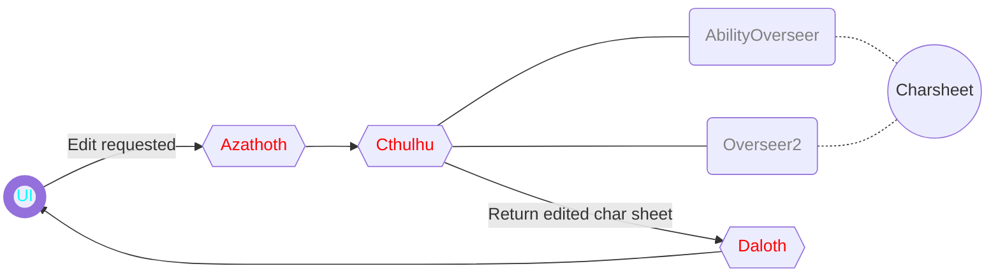
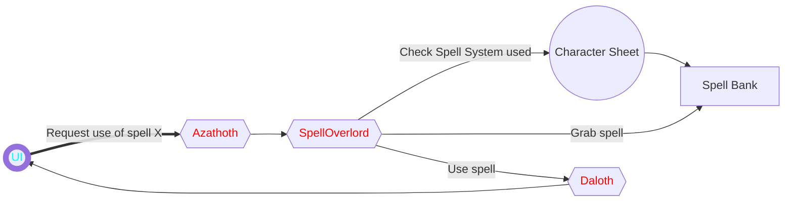

---

[[_TOC_]]

# BOREALIS

Borealis is meant to be an interactive supplementary program to the incredible <u>[Aurora Builder](https://aurorabuilder.com)</u> which inspired it.
The primary idea is to give the user a handy "real-time" assistant when they play DnD. From creating, saving, loading characters on the fly,
leveling them up, engaging in combat and so on.  
While Aurora is the "sit-down-relax" companion, Borealis will be the "in-the-trenches" ally.

# TODO
+ [ ] Review code todos
+ [ ] Compile Feats and Features extract generics
+ [ ] Draft program loop
+ [ ] Save/Import interface
+ [ ] Implement history
+ [ ] Import Classes when typing.TYPE_CHECKING

# Program Flow

### Flowchart

 ```mermaid
graph LR;
	classDef UI color:aqua,stroke-width:8px
	classDef Overlord color:red
	classDef Overseer color:grey
	
	UI((UI)):::UI
	Azathoth{{Azathoth}}:::Overlord
	Ares{{Ares}}:::Overlord
	Mnemosyne{{Mnemosyne}}:::Overlord
	Hypnos{{Hypnos}}:::Overlord
	Fortuna{{Fortuna}}:::Overlord
	Amun{{Amun}}:::Overlord
	Cthulhu{{Cthulhu}}:::Overlord
	Daloth{{Daloth}}:::Overlord
	SpellOverlord{{SpellOverlord}}:::Overlord
	UI((UI)):::UI
	extCond{Hypnos?}
	EXIT>Exit]
	
	%% Chaos
	UI --> |User input| Azathoth
	Azathoth --> |Combat| Ares --> Daloth
	Azathoth --> |Load| Mnemosyne --> Daloth
	Azathoth --> |Exit| Hypnos --> Daloth
	Azathoth --> |Dice Rolls| Fortuna --> Daloth
	Azathoth --> |Character Creation| Amun --> Daloth
	Azathoth --> |Character Edits| Cthulhu --> Daloth
	Azathoth --> |Use spells| SpellOverlord -->Daloth
	Daloth --> extCond
	extCond -->|YES| EXIT
	extCond -->|NO - Return output| UI
 ```





